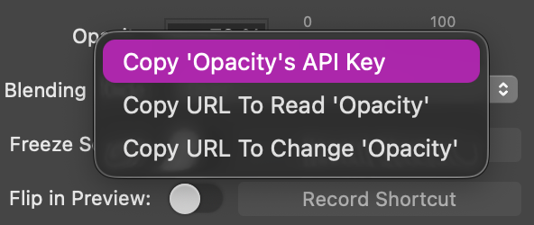
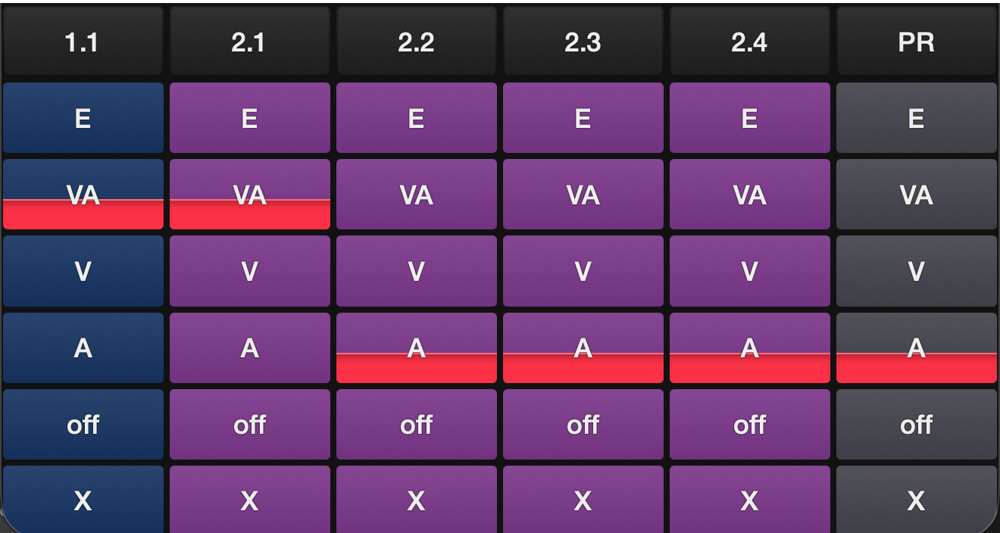

# mimoLive Automation System

## What is it?

A lightweight, procedural PHP automation system for controlling mimoLive via its HTTP API. Built with a frame-based queue system for precise timing control, it provides a flat keypath-based interface to the entire mimoLive API structure, enabling sophisticated automation workflows without object-oriented overhead.

The system loads the complete mimoLive API hierarchy (documents, layers, variants, layer-sets, outputs, sources, filters) into a flat named structure accessible via keypaths like `hosts/master/documents/MyShow/layers/Comments/live-state`, making it easy to control and monitor your live production programmatically.

## Installation

1. **Clone this repository**
   ```bash
   git clone https://github.com/forbiddenPHP/mimoLive-automation.git
   cd mimoLive-automation
   ```

2. **Install dependencies**
   ```bash
   brew install nginx
   brew install php
   ```

   **nginx config location on macOS:**
   - Apple Silicon: `/opt/homebrew/etc/nginx/nginx.conf`
   - Intel: `/usr/local/etc/nginx/nginx.conf`

3. **Configure nginx**

   Edit the nginx config file and add the following server block:

   ```nginx
   server {
       listen 8888;
       server_name localhost;

       root /path/to/mimoLive-automation;  # Change this to your repo path
       index index.php;

       location / {
           try_files $uri $uri/ /index.php?$query_string;
       }

       location ~ \.php$ {
           fastcgi_pass 127.0.0.1:9000;  # or unix:/opt/homebrew/var/run/php-fpm.sock
           fastcgi_index index.php;
           fastcgi_param SCRIPT_FILENAME $document_root$fastcgi_script_name;
           include fastcgi_params;
       }
   }
   ```

4. **Start the server**
   ```bash
   brew services start nginx
   brew services start php
   ```

5. **Test the setup**
   ```bash
   curl http://localhost:8888/?list
   ```

## How to call scripts from MimoLive Automation Layer?
  ```
   // Call a prepared Script from scripts-Folder (without .php):
   httpRequest(http://localhost:8888/?f=scriptname)

   // Call an inline action (must be urlencoded!):
   httpRequest(http://localhost:8888/?q=setLive%28%27fullpath%27%29)
  ```

## Supported Commands

**Note**: For brevity, examples use `$base = 'hosts/master/documents/MyShow/';`

### Primary Commands

These are the officially supported commands for controlling mimoLive:

#### Control Commands

- **`setLive($namedAPI_path)`** - Turn a layer or variant live
  ```php
  $base = 'hosts/master/documents/forbiddenPHP/';
  setLive($base.'layers/Comments');
  setLive($base.'layers/JoPhi DEMOS/variants/stop');
  setLive($base.'output-destinations/TV out');
  ```

- **`setOff($namedAPI_path)`** - Turn a layer off
  ```php
  setOff($base.'layers/Comments');
  setOff($base.'layers/MEv');
  setOff($base.'output-destinations/TV out');
  ```

- **`toggleLive($namedAPI_path)`** - Toggle a layer, variant, or document live state
  ```php
  toggleLive($base.'layers/Comments');  // Toggle layer on/off
  toggleLive($base.'layers/Lower3rd/variants/Red');  // Toggle variant
  toggleLive($base);  // Toggle document live state
  ```

- **`recall($namedAPI_path)`** - Recall a layer-set
  ```php
  recall($base.'layer-sets/RunA');
  recall($base.'layer-sets/OFF');
  ```

#### Variant Cycling Commands

- **`cycleThroughVariants($layer_path)`** - Cycle to next variant (wraps around to first)
  ```php
  cycleThroughVariants($base.'layers/Lower3rd');
  // Works with variant paths too (will be stripped to layer path):
  cycleThroughVariants($base.'layers/Lower3rd/variants/Red');
  ```
  *Note: Cycles through all variants continuously. After the last variant, returns to the first.*

- **`cycleThroughVariantsBackwards($layer_path)`** - Cycle to previous variant (wraps around to last)
  ```php
  cycleThroughVariantsBackwards($base.'layers/Lower3rd');
  ```
  *Note: Cycles through all variants in reverse. Before the first variant, returns to the last.*

- **`bounceThroughVariants($layer_path)`** - Cycle to next variant (stops at last)
  ```php
  bounceThroughVariants($base.'layers/Lower3rd');
  ```
  *Note: Stops at the last variant instead of wrapping around. Safe for linear progressions.*

- **`bounceThroughVariantsBackwards($layer_path)`** - Cycle to previous variant (stops at first)
  ```php
  bounceThroughVariantsBackwards($base.'layers/Lower3rd');
  ```
  *Note: Stops at the first variant instead of wrapping around.*

- **`setLiveFirstVariant($layer_path)`** - Jump to first variant
  ```php
  setLiveFirstVariant($base.'layers/Lower3rd');
  ```

- **`setLiveLastVariant($layer_path)`** - Jump to last variant
  ```php
  setLiveLastVariant($base.'layers/Lower3rd');
  ```

#### Signal Triggering

- **`trigger($signal_name, $path)`** - Trigger a signal on a layer, variant, source, or filter
  ```php
  // Trigger signal on a layer
  trigger('Dis 7', $base.'layers/Video Switcher');

  // Trigger signal on a variant
  trigger('Cut Below', $base.'layers/Video Switcher/variants/Auto');

  // Trigger signal on a source
  trigger('Reset', $base.'sources/MySource');

  // Trigger signal on a filter
  trigger('Pulse', $base.'sources/MySource/filters/MyFilter');
  ```
  *Note: Signal names are normalized (spaces and underscores removed, case-insensitive). The function searches for matching signals in the path's input-values that end with `_TypeSignal`. For example, `'Dis 7'` matches `tvGroup_Control__Dis_7_TypeSignal`.*

#### Screenshot/Snapshot

- **`snapshot($path, $width=null, $height=null, $format=null, $filepath=null)`** - Capture screenshot from program output or source preview
  ```php
  // Capture program output with defaults (dimensions/format from metadata)
  snapshot($base);

  // Custom dimensions and format
  snapshot($base, 1920, 1080, 'png');

  // Custom filepath
  snapshot($base, 1920, 1080, 'png', './my-snapshots/custom.png');

  // Capture source preview
  snapshot($base.'sources/Camera 1');
  ```
  *Note: Default save path is `./snapshots/` with auto-generated filename: `"ShowName 2026-01-24 12-34-56 DeviceName 1920x1080.png"`. Width/height/format are read from metadata if not specified. For documents, uses `/programOut` endpoint; for sources, uses `/preview` endpoint.*

#### Web Browser Control

- **`openWebBrowser($source_path)`** - Open the browser in a Web Browser Capture source
  ```php
  // Open the web browser in a Web Browser source
  openWebBrowser($base.'sources/Web Browser');
  ```
  *Note: This function validates that the source is a Web Browser Capture source (`com.boinx.mimoLive.sources.webBrowserSource`) before sending the command.*

#### Property Updates

- **`setValue($namedAPI_path, $updates_array)`** - Update properties of documents, layers, variants, sources, filters, or outputs
  ```php
  // Document-level properties
  setValue($base, ['programOutputMasterVolume' => 0.8]);

  // Layer properties
  setValue($base.'layers/MEa', ['volume' => 0.5]);

  // Source properties
  setValue($base.'sources/a1', ['gain' => 1.2]);

  // Source text content (input-values)
  setValue($base.'sources/Color', [
      'input-values' => [
          'tvGroup_Content__Text_TypeMultiline' => 'Hello World'
      ]
  ]);

  // Multiple properties at once
  setValue($base.'layers/MEa', ['volume' => 0.5, 'opacity' => 0.8]);
  ```

- **`setVolume($namedAPI_path, $value)`** - Convenient shortcut to set volume/gain across different contexts
  ```php
  // Automatically uses the correct property based on context:
  setVolume($base, 0.8);                                    // Document: programOutputMasterVolume
  setVolume($base.'layers/MEa', 0.5);                       // Layer: volume
  setVolume($base.'layers/JoPhi DEMOS/variants/stop', 0.3); // Variant: volume
  setVolume($base.'sources/a1', 1.2);                       // Source: gain
  ```
  *Note: This is a convenience wrapper around `setValue()` that automatically selects the correct property name (`programOutputMasterVolume`, `volume`, or `gain`) based on whether you're targeting a document, layer/variant, or source.*

- **`setAnimateVolume($namedAPI_path, $target_value, $steps=null, $fps=null)`** - Animate volume/gain smoothly over time
  ```php
  // Animate to 100% volume using default settings (30 steps @ 30fps = 1 second)
  setAnimateVolume($base.'layers/MEa', 1.0);
  setSleep(0);  // Execute all queued animation frames

  // Animate with custom step count (60 steps @ 30fps = 2 seconds)
  setAnimateVolume($base.'layers/MEa', 0.0, 60);
  setSleep(0);

  // Animate with custom speed (30 steps @ 15fps = 2 seconds, slower)
  setAnimateVolume($base.'layers/MEa', 0.5, 30, 15);
  setSleep(0);

  // Fast animation (30 steps @ 60fps = 0.5 seconds)
  setAnimateVolume($base.'layers/MEa', 1.0, 30, 60);
  setSleep(0);

  // Multiple layers animated in parallel
  setAnimateVolume($base.'layers/MEv', 1.0, 30, 30);
  setAnimateVolume($base.'layers/MEa', 1.0, 30, 30);
  setSleep(0);  // Both animate together
  ```
  *Parameters:*
  - `$target_value` (required): Target volume (0.0 - 1.0)
  - `$steps` (optional): Number of steps, defaults to framerate from config.ini (e.g., 30)
  - `$fps` (optional): Animation speed in frames per second, defaults to framerate from config.ini (e.g., 30)

  *Note: Reads current volume from namedAPI and interpolates to target value. Skips animation if already at target. Multiple animations on different layers run in parallel. Like `setVolume()`, automatically handles document/layer/source contexts.*

- **`setAnimateValue($namedAPI_path, $updates_array, $steps=null, $fps=null)`** - Animate any animatable property smoothly over time
  ```php
  // Animate opacity and rotation together (30 steps @ 30fps = 1 second)
  setAnimateValue($base.'layers/Placer', [
      'input-values' => [
          'tvGroup_Content__Opacity' => 100,
          'tvGroup_Geometry__Rotation' => 360
      ]
  ]);
  setSleep(0);

  // Animate color using mimoColor() (20 steps @ 30fps ≈ 0.67 seconds)
  setAnimateValue($base.'sources/Color', [
      'input-values' => [
          'tvGroup_Background__Color' => mimoColor('#b700ff')
      ]
  ], 20, 30);
  setSleep(0);

  // Mix animatable and non-animatable properties
  setAnimateValue($base.'sources/Color', [
      'input-values' => [
          'tvGroup_Content__Text_TypeMultiline' => 'Hello World!',  // Set once on frame 0
          'tvGroup_Background__Color' => mimoColor('#19e42d'),      // Animated over all frames
          'tvGroup_Geometry__Rotation' => 180                       // Animated (wheel: shortest path)
      ]
  ], 30, 30);
  setSleep(2);
  ```
  *Parameters:*
  - `$updates_array` (required): Array of properties to animate (same structure as `setValue()`)
  - `$steps` (optional): Number of steps, defaults to framerate from config.ini
  - `$fps` (optional): Animation speed in frames per second, defaults to framerate from config.ini

  *Supported property types:*
  - **number**: Linear interpolation (e.g., opacity, position, size)
  - **number with degrees (°)**: Wheel animation taking shortest path (e.g., rotation 180° → 0° goes via 90° → 0°, not via 270° → 360° → 0°)
  - **color**: RGBA component interpolation (use `mimoColor()` for convenient color specification)
  - **string, bool, index, image**: Not animatable - set once on frame 0

  *Note: Like `setValue()`, accepts nested arrays with multiple properties. Animatable properties (number, color) interpolate smoothly across frames. Non-animatable properties (string, bool, etc.) are set once on the first frame only. Multiple `setAnimateValue()` calls on different resources run in parallel.*

- **`increment($base, $var, $val)`** - Increment a numeric property by a specified amount
  ```php
  $placer = 'hosts/master/documents/MyShow/layers/Placer';

  // Increment input-values (auto-detected by __ in variable name)
  increment($placer, 'tvGroup_Content__Opacity', 10);      // Slider: clamped to min/max
  increment($placer, 'tvGroup_Geometry__Rotation', 45);    // Wheel: wraps around at 360°

  // Increment direct properties (no __ in variable name)
  increment($placer, 'volume', 0.2);
  increment($placer, 'gain', 0.1);
  ```
  *Parameters:*
  - `$base` (required): Base path to the resource (layer, source, output)
  - `$var` (required): Variable name (use "Copy API Key" from right-click menu on setting label)
  - `$val` (required): Amount to increment by

  *Behavior:*
  - **Input-values** (contains `__`): Automatically prefixes `/input-values/` to the path
  - **Direct properties** (no `__`): Uses path as-is (e.g., `volume`, `gain`)
  - **Sliders**: Values are clamped to min/max from input-descriptions
  - **Wheels** (unit = °): Values wrap around (e.g., 350° + 30° = 20°)
  - Only works on numeric values, returns error for non-numeric types

  

- **`decrement($base, $var, $val)`** - Decrement a numeric property by a specified amount
  ```php
  $placer = 'hosts/master/documents/MyShow/layers/Placer';

  // Decrement input-values
  decrement($placer, 'tvGroup_Content__Opacity', 15);      // Slider: clamped to min/max
  decrement($placer, 'tvGroup_Geometry__Rotation', 90);    // Wheel: wraps around

  // Decrement direct properties
  decrement($placer, 'volume', 0.2);
  ```
  *Parameters and behavior identical to `increment()`, but subtracts the value instead of adding it.*

#### Timing Commands

- **`setSleep($seconds, $reloadNamedAPI=true)`** - Execute all queued frames and optionally wait additional time
  ```php
  setSleep(0);      // Execute all queued frames, no additional wait
  setSleep(2.5);    // Execute all queued frames, then wait 2.5 seconds
  setSleep(1, false); // Execute, wait 1 second, don't reload namedAPI
  ```
  *Note: This is the primary execution function. It processes all frames currently in the queue (executing actions in parallel for each frame, with 1/framerate second sleep between frames). After all queued frames are processed, it waits for the specified `$seconds` duration. By default (`$reloadNamedAPI=true`), the namedAPI is rebuilt after execution, making updated values available for subsequent commands. Set to `false` to skip the rebuild if you don't need updated values. Framerate is read from `config.ini` (typically 25 or 30 FPS).*

#### Conditional Execution

- **`butOnlyIf($path, $operator, $value1, $value2=null)`** - Conditionally execute or skip the queued actions
  ```php
  // Only turn off layers if ducking is disabled
  setOff($base.'layers/Comments');
  setOff($base.'layers/MEv');
  setOff($base.'layers/MEa');
  butOnlyIf($base.'layers/MEa/attributes/tvGroup_Ducking__Enabled', '==', false);
  ```

### Helper Functions

These functions simplify common tasks:

- **`getID($path)`** - Get the ID of any resource (device, layer, source, etc.)
  ```php
  // Returns the ID from namedAPI path, or none-source ID as fallback
  $source_id = getID($base.'sources/Color');

  // Use inline in setValue() arrays - this is the power of getID()!
  setValue($base.'layers/MyLayer', [
      'source' => getID($base.'sources/Color'),  // Inline usage!
      'volume' => 0.5
  ]);

  // Works with any resource type
  $device_id = getID('hosts/master/devices/MyCamera');
  $layer_id = getID($base.'layers/Comments');
  $variant_id = getID($base.'layers/Lower3rd/variants/Red');
  ```
  *Returns: The resource ID string, or `'2124830483-com.mimolive.source.nonesource'` if path not found*

- **`mimoColor($color_string)`** - Convert color strings to mimoLive color format
  ```php
  // Hex format (1-8 characters)
  mimoColor('#F')          // → White (#FFFFFFFF)
  mimoColor('#FA')         // → White, but a bit of transparency (#FFFFFFAA)
  mimoColor('#F73')        // → RGB shorthand (#FF7733FF)
  mimoColor('#F73A')       // → RGBA shorthand (#FF7733AA)
  mimoColor('#FF5733')     // → Full RGB (#FF5733FF)
  mimoColor('#FF5733AA')   // → Full RGBA (#FF5733AA)

  // RGB/RGBA format (0-255)
  mimoColor('255,128,64')      // → RGB
  mimoColor('255,128,64,200')  // → RGBA

  // Percentage format
  mimoColor('100%,50%,25%')       // → RGB
  mimoColor('100%,50%,25%,80%')   // → RGBA

  // Use in setValue with color properties
  setValue($base.'sources/Color', [
      'input-values' => [
          'tvGroup_Background__Color' => mimoColor('#FF0000')
      ]
  ]);
  ```
  *Returns: `['red' => float, 'green' => float, 'blue' => float, 'alpha' => float]` with values 0-1*

- **`mimoPosition($prefix, $width, $height, $top, $left, $namedAPI_path)`** - Calculate position/dimensions in mimoLive units
  ```php
  // Pixel values
  setValue($base.'layers/MEv/variants/dyn', [
      'input-values' => [
          ...mimoPosition('tvGroup_Geometry__Window', 800, 600, 100, 200, $base)
      ]
  ]);

  // Percentage values
  ...mimoPosition('tvGroup_Geometry__Window', '50%', '40%', '10%', '25%', $base)
  ```
  *Returns: Array with `_Left_TypeBoinxX`, `_Top_TypeBoinxY`, `_Right_TypeBoinxX`, `_Bottom_TypeBoinxY` keys*

- **`mimoCrop($prefix, $top, $bottom, $left, $right, $namedAPI_path=null)`** - Calculate crop values in percentages
  ```php
  // Percentage values (no path needed)
  ...mimoCrop('tvGroup_Geometry__Crop', '10%', '10%', '5%', '5%')

  // Pixel values (uses source resolution from path)
  ...mimoCrop('tvGroup_Geometry__Crop', 50, 50, 100, 100, $base.'sources/Camera')
  ```
  *Returns: Array with `_Top`, `_Bottom`, `_Left`, `_Right` keys (percentage values)*

### Advanced/Internal Functions

These functions are available but are typically used internally:

#### Auto Grid Layout

- **`setAutoGrid($document_path, $gap, $color_default, $color_highlight, $top=0, $left=0, $bottom=0, $right=0)`** - Automatically arrange video placers in intelligent layouts for video conferences

  **Overview:**
  Creates balanced layouts for multiple video sources with automatic aspect-ratio preservation:
  - **Presenter Mode**: Main presenter with smaller participants on sides
  - **Groups Mode**: Multiple equal groups arranged side-by-side or stacked
  - **Exclusive Mode**: One fullscreen, others hidden
  - **Automatic Expansion**: Visible layers expand when others are hidden

  **Basic Usage:**
  ```php
  $base = 'hosts/master/documents/MyShow';

  // Simple grid with 2% gap, 30px margins
  setAutoGrid($base, '2%', '#FFFFFFFF', '#FF00FFFF', 30, 30, 30, 30);

  // Fullscreen without borders/rounding (gap=0)
  setAutoGrid($base, 0, '#FFFFFFFF', '#FF00FFFF', 0, 0, 0, 0);

  // Space at bottom for lower third (300px)
  setAutoGrid($base, '2%', '#FFFFFFFF', '#FF00FFFF', 30, 30, 300, 30);

  // Space at top for title/logo (300px)
  setAutoGrid($base, '2%', '#FFFFFFFF', '#FF00FFFF', 300, 30, 30, 30);
  ```

  **Layer Naming Convention:**

  The system requires specific layer naming:

  1. **Video Placer Layers:**
     ```
     av_pos_1_group_1    // Position 1, Group 1
     av_pos_2_group_1    // Position 2, Group 1
     av_pos_1_group_2    // Position 1, Group 2
     av_presenter        // Presenter (optional)
     ```

  2. **Audio-Only Layers (optional):**
     ```
     a_pos_1_group_1     // Audio for position 1, group 1
     a_presenter         // Audio for presenter
     ```

  3. **Control Script Layers (with variants):**
     ```
     s_av_pos_1_group_1  // Controls av_pos_1_group_1
     s_av_pos_2_group_1  // Controls av_pos_2_group_1
     s_av_presenter      // Controls av_presenter
     ```

  **Required Variants:**

  Each control layer (`s_av_*`) MUST have these 5 variants:

  | Variant | Meaning | Video | Audio |
  |---------|---------|-------|-------|
  | `video-and-audio` | Normally visible | ✓ Yes | ✓ Yes |
  | `video-no-audio` | Video without sound | ✓ Yes | ✗ No |
  | `audio-only` | Audio only, no video | ✗ No | ✓ Yes |
  | `off` | Completely off | ✗ No | ✗ No |
  | `exclusive` | Fullscreen trigger | ✓ Fullscreen | ✓ Yes |

  Additional status: `exclude` when control layer itself is off (live-state)

  **Modes:**

  *Presenter Mode* (active when `s_av_presenter` exists AND is visible):
  - Presenter centered (sized to fit available space, aspect-ratio preserved)
  - Other positions alternating left/right (zig-zag)
  - Position number determines vertical order (1=top, 2=below, etc.)
  - Side tiles are square, sized based on available height
  - If only presenter + 1 position visible: Position hidden, presenter takes full space

  *Groups Mode* (active when NO presenter is visible):
  - Groups arranged horizontally (16:9) or vertically (9:16)
  - Each group gets equal space
  - Within each group: Grid layout based on number of visible layers
  - If only 1 group has visible layers: Takes full working area
  - If only 1 layer in group: Takes full group size

  *Exclusive Mode* (active when ONE control layer is on `exclusive` variant):
  - Exclusive layer takes full working area (fullscreen)
  - All other layers shrink to size 0 at center
  - Exclusive layer gets `volume: 1.0`
  - Other layers keep their audio (NOT muted)
  - If 2+ exclusives simultaneously: Session-based transition logic triggers

  **Expansion:**

  When layers are hidden (status: `exclude`, `off`, `audio-only`):
  - Visible layers expand to optimally use available space
  - Hidden layers shrink to center of their original relative position

  **Parameters:**
  - `$document_path` (required): Document path (e.g., `'hosts/master/documents/MyShow'`)
  - `$gap` (required): Space between placers - percentage (e.g., `'2%'`) or pixels (e.g., `20`)
    - `gap = 0`: Fullscreen mode → No borders, no rounding
    - `gap > 0`: Grid mode → Borders (double standard thickness), rounded corners
  - `$color_default` (required): Border color for normal placers (hex, e.g., `'#FFFFFFFF'`)
  - `$color_highlight` (required): Border color for exclusive placer (hex, e.g., `'#FF00FFFF'`)
  - `$top` (optional): Top margin - pixels or percentage (e.g., `30` or `'10%'`), default `0`
  - `$left` (optional): Left margin - pixels or percentage, default `0`
  - `$bottom` (optional): Bottom margin - pixels or percentage, default `0`
  - `$right` (optional): Right margin - pixels or percentage, default `0`

  **Examples:**

  Standard conference (Presenter + 6 participants):
  ```php
  // Setup: s_av_presenter + s_av_pos_1..6_group_1
  setAutoGrid($base, '2%', '#FFFFFF', '#FF00FF', 30, 30, 30, 30);
  ```

  Two groups (Team A vs Team B):
  ```php
  // Setup: s_av_pos_1..4_group_1 + s_av_pos_1..4_group_2
  setAutoGrid($base, '1.5%', '#FFFFFF', '#00FFFF', 50, 50, 50, 50);
  ```

  Seamless fullscreen:
  ```php
  // No gap = no borders, no rounding
  setAutoGrid($base, 0, '#FFFFFF', '#FF00FF', 0, 0, 0, 0);
  ```

  **mimoLive Control Surface Compatibility:**

  `setAutoGrid()` is fully compatible with mimoLive's Control Surfaces feature. You can create intuitive button layouts to switch between variants for each position:

  

  The example document `autoGridTest.tvShow` demonstrates this setup with a complete Control Surface configuration.

- **`wait($seconds)`** - Pause execution without processing frames (internal use)
  ```php
  wait(1.0); // Wait 1 second, no frame processing
  ```
  *Note: Use `setSleep()` for timed sequences.*

- **`setSleep($seconds, $reloadNamedAPI=true)`** - Execute queue and wait (block boundary)
  ```php
  setSleep(2);  // Execute, wait 2s, reload namedAPI
  setSleep(1, false);  // Execute, wait 1s, no reload
  ```

*Note: If you debug your script, you can use `run();`. It executes the block(s) above and exits afterwards. Following blocks are ignored.*

### Post Condition

- **`butOnlyIf($path, $operator, $value1, $value2=null, $andSleep=0)`** - Conditionally execute queued actions
  ```php
  setLive($base.'layers/Comments');
  butOnlyIf($base.'layers/MEa/volume', '==', 0);

  // With sleep after execution
  setOff($base.'layers/MEa');
  butOnlyIf($base.'layers/MEa/live-state', '==', 'live', andSleep: 2);
  ```

## What is a post condition?

A post condition (`butOnlyIf`) evaluates the current state of the namedAPI **after** actions have been queued but **before** they are executed. If the condition evaluates to `false`, the entire queue is cleared and those actions are skipped.

### Supported Operators

- `==` - Equal to
- `!=` - Not equal to
- `<` - Less than
- `>` - Greater than
- `<=` - Less than or equal to
- `>=` - Greater than or equal to
- `<>` - Between (inclusive): `$value1 <= $current <= $value2`
- `!<>` - Not between

### How it works

1. Actions are added to the queue via `setLive()`, `setOff()`, or `recall()`
2. `butOnlyIf()` checks the condition against the current namedAPI state
3. If condition is `true`: Queue is processed normally
4. If condition is `false`: Queue is cleared, actions are skipped
5. Frame counter increments and execution continues

### Example

```php
$base = 'hosts/master/documents/MyShow/';

label_and_braces_not_necessary_just_to_see_it_better: 
{
  // Queue the Comments layer to go live
  setLive($base.'layers/Comments');
  setLive($base.'layers/Lower3rd');

  // Only execute if YouTube stream is actually live, then wait 5 seconds
  butOnlyIf($base.'outputs/YouTube/live-state', '==', 'live', andSleep: 5);
}

// Turn off graphics (new queue, always executes)
setOff($base.'layers/Comments');
setOff($base.'layers/Lower3rd');
```

**Important**: PHP's type juggling is used for value comparisons (`==`), allowing flexible matching between strings, numbers, and booleans. The string `"live"` will match the string `"live"`, `1` will match `true`, etc.

## Debug Helpers for your scripts

Use firefox to call `?list`, `translate`, `?{any}&test=true`, or `?{any}&realtime=true`. It can render json.

### Execution Modes

- **`?f=scriptname`** - Background execution (default)
  - Script executes immediately and returns success message
  - No waiting, no debug output
  - Use for production automation calls from mimoLive

- **`?f=scriptname&test=true`** - Test mode with debug output
  - Waits for script completion
  - Shows detailed debug information (API calls, calculations, etc.)
  - Returns complete execution log as JSON
  - Use for development and debugging

- **`?f=scriptname&realtime=true`** - Realtime execution without debug output
  - Waits for script completion
  - No debug output (clean execution)
  - Returns final result as JSON
  - **Perfect for loops** (scripts < 10 seconds that run repeatedly)
  - **Ideal for `setAutoGrid()`** - mimoLive can loop the call and get updated status in realtime

  Example in mimoLive Automation Layer (While Live script):
  ```php
  httpRequest("http://localhost:8888/?f=update-grid&realtime=true");
  ```
  This allows mimoLive to continuously update the grid layout as participant states change.

### List API Keypaths

The `?list` endpoint provides introspection into the current namedAPI state, making it easy to discover available keypaths and their values.

- **`/?list`** - Returns all keypaths with their current values as a flat JSON structure
  ```zsh
  curl http://localhost:8888/?list | jq
  ```

- **`/?list=filter`** - Returns only keypaths containing the filter string (case-insensitive)
  ```zsh
  # Show all live-state values
  curl http://localhost:8888/?list=live-state | jq

  # Show all layer information
  curl http://localhost:8888/?list=layers | jq

  # Find specific layer data
  curl http://localhost:8888/?list=layers/Comments | jq
  ```

**Use cases:**
- Discover all the available pathes (for copy and paste?)
- Find the exact keypath for a specific resource
- Monitor API state during development

### Translate mimoLive API URLs to Keypaths

The `?translate` endpoint converts mimoLive API URLs into namedAPI keypaths, useful when working with the mimoLive HTTP API directly.

- **`/?translate=/api/v1/documents/{doc_id}/...`** - Converts API URL to keypath
  ```bash
  # Translate a layer URL
  curl "http://localhost:8888/?translate=/api/v1/documents/2124830483/layers/AC981F10-56A1-4206-A441-CEB13ED240A4" | jq

  # Translate a variant URL
  curl "http://localhost:8888/?translate=/api/v1/documents/2124830483/layers/AC981F10-56A1-4206-A441-CEB13ED240A4/variants/6F2105C4-6AFB-4300-B6C6-0D65F00BCD75" | jq
  ```

**Example output:**
```json
{
  "path": "hosts/master/documents/forbiddenPHP/layers/RunAndStop/variants/stop",
  "code": 200
}
```

**Use cases:**
- Convert API URLs from mimoLive's Copy API Endpoint feature to script-friendly keypaths
- Debug API responses by translating returned resource URLs
- Quickly find the keypath when you know the UUID from API logs

## Notes

### Using Standard PHP Control Structures

You can use regular PHP control flow (`if`, `switch`, even own functions etc.) to check values before queueing actions or set a block:

```php
// Check namedAPI state at script start
if (namedAPI_get($base.'layers/Comments/live-state') == 'live') {
    setOff($base.'layers/Comments');
}

// Check results after executing a block
setValue($base.'layers/Lower3rd', ['opacity' => 0.5]);
setSleep(1);

if (namedAPI_get($base.'layers/Lower3rd/opacity') == 0.5) {
    setLive($base.'layers/Lower3rd');
}

// Create interactive blocks with switch
$current_variant = namedAPI_get($base.'layers/Lower3rd/live-variant-name');
switch ($current_variant) {
    case 'Red':
        setLive($base.'layers/Lower3rd/variants/Blue');
        setSleep(5);
        break;
    case 'Blue':
        setLive($base.'layers/Lower3rd/variants/Green');
        setSleep(3);
        break;
    default:
        setLive($base.'layers/Lower3rd/variants/Red');
        setSleep(2);
}
```

See `setSleep()` documentation for details on when the namedAPI is reloaded.